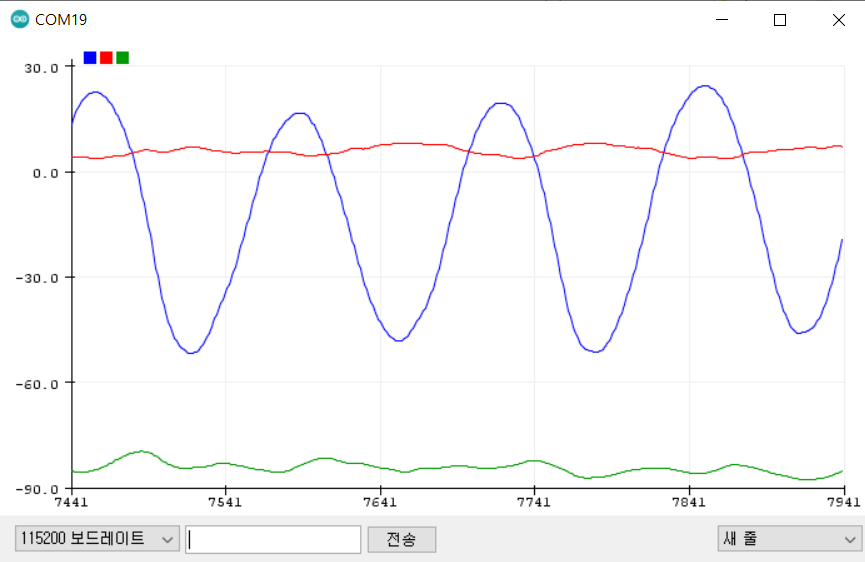

# STM32_MPU6050_ComplementartFilter

This project explain easy approach to get Roll, Pitch, Yaw angle by using MPU6050.


# Description
By using Acc data, you can get Acc Angle.
```
void CalculateAccAngle(Struct_Angle* Angle, Struct_MPU6050* MPU6050)
{
	Angle->acc_roll  = atan(-MPU6050->acc_x / sqrt(pow(MPU6050->acc_y,2) + pow(MPU6050->acc_z,2))) * RADIAN_TO_DEGREE;
	Angle->acc_pitch = atan(MPU6050->acc_y / sqrt(pow(MPU6050->acc_x,2) + pow(MPU6050->acc_z,2))) * RADIAN_TO_DEGREE;
//	Angle->acc_yaw = atan(sqrt(pow(MPU6050->acc_x, 2) + pow(MPU6050->acc_y, 2)) / MPU6050->acc_z) * RADIAN_TO_DEGREE;
	//Can't use Angle->acc_yaw there is no reliability. It's based on my personal experimental view.
}
```

By using Gyro data, you can get Gyro Angle.
```
void CalculateGyroAngle(Struct_Angle* Angle, Struct_MPU6050* MPU6050)
{
	Angle->gyro_roll  += MPU6050->gyro_y * dt;
	Angle->gyro_pitch += MPU6050->gyro_x * dt;
	Angle->gyro_yaw   += MPU6050->gyro_z * dt;
}
```
<br/>
<br/>
<br/>
Acc Angle has high frequency noise.

And gyro Angle has low frequency.

Each of the Angle has low reliability.

However you can get reliable Angle value by using ComplementartFilter.
```
void CalculateCompliFilter(Struct_Angle* Angle, Struct_MPU6050* MPU6050)
{
	CalculateAccAngle(Angle, MPU6050); //Prepare Acc Angle before using Complimentary Filter.

	static float alpha = 0.96f;
	Angle->ComFilt_roll  = alpha*(MPU6050->gyro_y * dt + Angle->ComFilt_roll) + (1-alpha) * Angle->acc_roll;
	Angle->ComFilt_pitch = alpha*(MPU6050->gyro_x * dt + Angle->ComFilt_pitch) + (1-alpha) * Angle->acc_pitch;
	Angle->ComFilt_yaw   = Angle->ComFilt_yaw + MPU6050->gyro_z * dt;
}
```

# Code
This project succeed to this project https://github.com/creative-apple/STM32-MPU6050

Follow the predecessor project for better understanding.

If you already followed predecessor project, you need to add only one line to get Angle.

```
	if(MPU6050_DataReady() == 1)
	{
		MPU6050_ProcessData(&MPU6050);
		//CalculateAccAngle(&Angle, &MPU6050);
		//printf("%f, %f, %f\n", Angle.acc_roll, Angle.acc_pitch, Angle.acc_yaw);
		//CalculateGyroAngle(&Angle, &MPU6050);
		//printf("%f, %f, %f\n", Angle.gyro_roll,Angle.gyro_pitch,Angle.gyro_yaw);
		CalculateCompliFilter(&Angle, &MPU6050);
		printf("%f, %f, %f\n", Angle.ComFilt_roll,Angle.ComFilt_pitch,Angle.ComFilt_yaw);
	}
```

# Result

